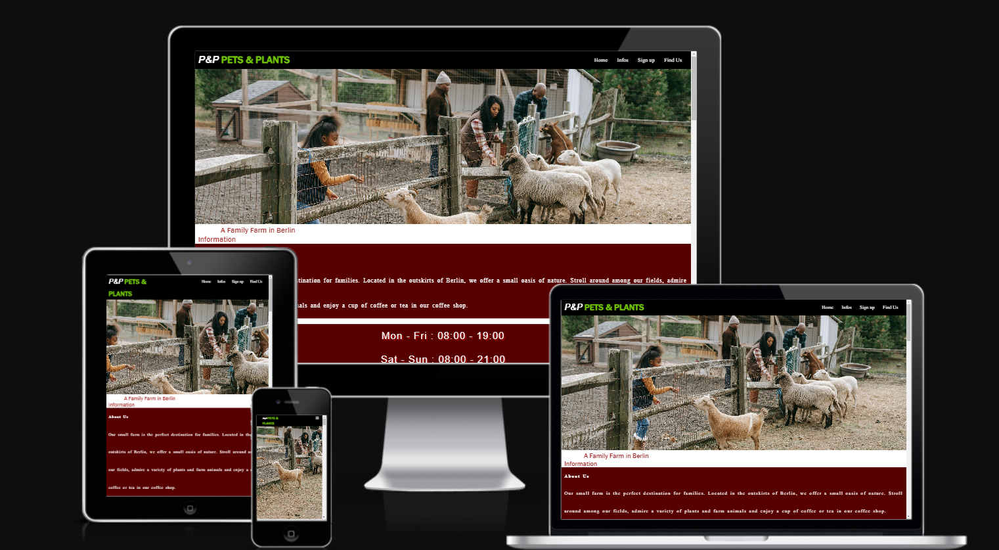
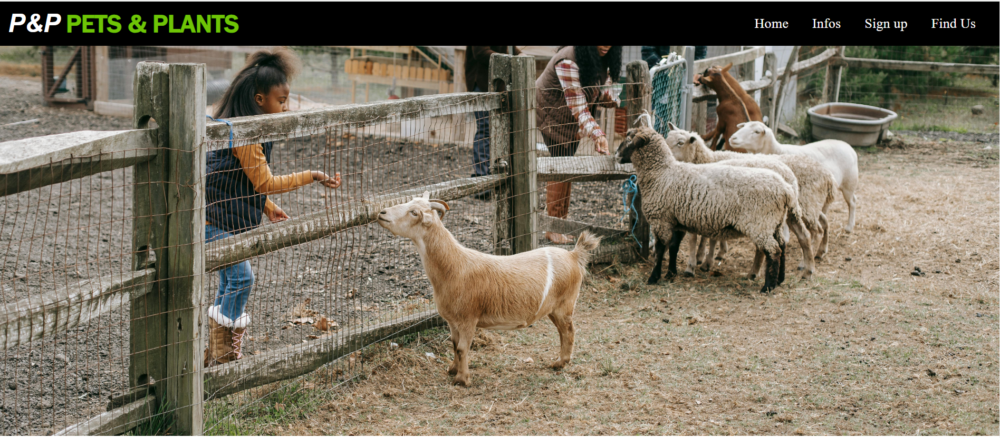
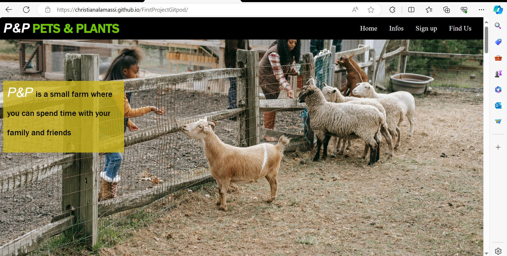
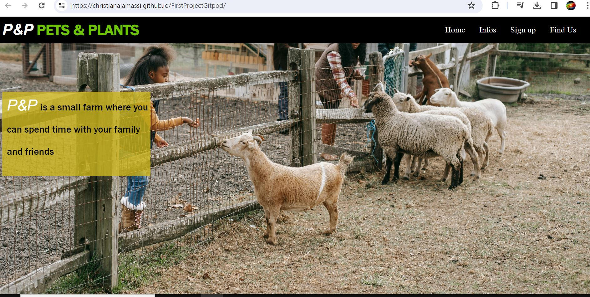
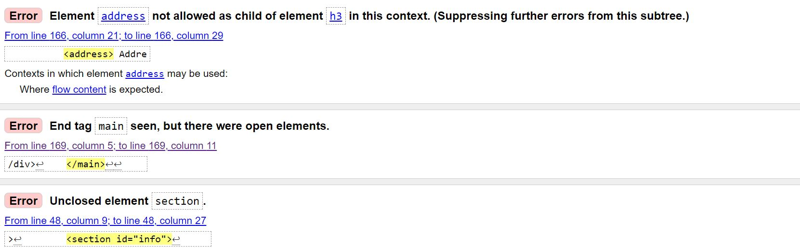

# [P&P Pets and Plants](https://christianalamassi.github.io/Pets-and-Plants/)

 P&P is the website of a farm in the outskirts of Berlin, that keeps a variety of farm animals and plants for people to admire and that welcomes people in their coffee shop. The site is aimed at people interested in visiting the farm. Users can get an overview of what the location has to offer, how to contact it, and where to find it. Users can also subscribe to the farm's newsletter. 

## Features

### Navigation bar

- The navigation bar includes links to Home page, Infos page, Sign Up page and Find Us page.
- It allows the user to navigate easily without scrolling up and down. 
- The navigation bar is fixed so that the user can access it at all times. 

### The home page image

 The home page image gives the user of the website a first impression about the advertised location and the overlying text offers a small description about it. 

### Information

#### This page includes the five sections "About Us", "Opening Hours", "Our Pets", "Our Plants" and "Enjoy a drink in our Coffee Shop"clea

- About Us gives an overview of what the location has to offer to visitors.
- Opening Hours informs the user of the times the location is open for visits.
- Our Pets gives the user an overview in the form of a gallery of which farm animals he or she can admire there.
- Our Plants gives the user an overview in the form of a gallery of which plants he or she can admire there.
- Enjoy a drink in our Coffee Shop shows the drinks menu including prices.

### Sign Up for our newsletter

 On this page the user can submit his or her information in order to subscribe to the farm's newsletter. 

### Footer
  This page shows the user all of the contact information of the farm and it's location.

  The footer provides links to the farm's social media pages. The links open to a new tab. 

  

## Testing

- I tested my project in two different browsers (Chrome and Edge) and the results were satisfying.

 

- I also tested my project on different screen sizes (laptop screens, desktop screens, tablet screens and phone screens) and was content with the results here as well.

- I confirmed the project is easy to use and the nav bar, the header, sign up and about us are easy to understand for the user. 

#### I found three errors in HTML, they are fixed :

- The address element wasn't allowed as a child of element h3.
- End tag <main> was seen, but there were open elements.
- Unclosed element section.

## Validator Testing

### HTML 
 No errors were returned when passing through the official [W3C validator](https://validator.w3.org/nu/?doc=https%3A%2F%2Fchristianalamassi.github.io%2FFirstProjectGitpod%2F)

### CSS
No errors were found when passing through the official [(Jigsaw) validator](https://jigsaw.w3.org/css-validator/validator?uri=https%3A%2F%2Fchristianalamassi.github.io%2FFirstProjectGitpod%2F&profile=css3svg&usermedium=all&warning=1&vextwarning=&lang=en)

### Accessability

 I confirmed that the colors and fonts are clear for the users, by running it through the lighthouse in divtools, although the images are a littel bit slower download.

## Deployment

### The site was deployed to GitHub pages through the following steps:
- In the GitHub repository, navigate to the Settings tab
- From the source section drop-down menu, select the main
- Once the main has been selected, the page will be automatically refreshed with a 
- detailed ribbon display to indicate the successful deployment.
- The live link is here [P&P Pets and Plants](https://christianalamassi.github.io/Pets-and-Plants/)

## Credits

 ### Websits were useed
  [W3](https://validator.w3.org/#validate_by_input), [css-validato](https://jigsaw.w3.org/css-validator/), [amiresponsive](https://ui.dev/amiresponsive),[Fontawesom](https://fontawesome.com/),[favicon](https://www.favicon.cc/)

### inspiration
 [Love Running](https://learn.codeinstitute.net/courses/course-v1:CodeInstitute+CSSE_PAGPPF+2021_Q2/courseware/66cf361c769a41d496f5001fae6f9be7/3b5cd5dc8313462aa5975a3c9b9a1a3c/)

### Media
- the images were taken from [Pixabay](https://pixabay.com/), [freeimages](https://www.freeimages.com/), [pexels](https://www.pexels.com/search/farm%20with%20kids/)